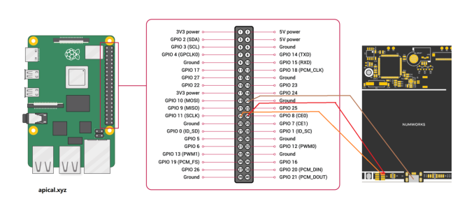

# Unlocking the NumWorks N0120 Graphing Calculator

A guide to unlocking the NumWorks N0120 graphing calculator and gaining full control over its hardware.

---

## Table of Contents

* [Disclaimer](#disclaimer)
* [Overview](#overview)
* [Prerequisites](#prerequisites)
* [Unlocking with a Raspberry Pi](#unlocking-with-a-raspberry-pi)

  * [Required Hardware](#required-hardware)
  * [Installation](#installation)
  * [Wiring](#wiring)
  * [Unlocking the Calculator](#unlocking-the-calculator)
* [Flashing Custom Firmware](#flashing-custom-firmware)
* [Bootloader Information](#bootloader-information)

  * [Extracting the Original Bootloader](#extracting-the-original-bootloader)
  * [Patching the Bootloader](#patching-the-bootloader)
* [Alternative Bootloader](#alternative-bootloader)
* [Experimental ST-Link Method](#experimental-st-link-method)
* [Troubleshooting](#troubleshooting)
* [Credits](#credits)
* [Legal Notice](#legal-notice)
---

## Disclaimer

This process modifies the calculator's internal security settings and erases its flash memory. Proceed at your own risk.

Neither the authors of this repository nor NumWorks are responsible for any damage caused by following this guide.

---

## Overview

The NumWorks N0120 uses an STM32 microcontroller protected by Readout Protection (RDP). This prevents users from accessing or modifying the device's firmware.

After completing the unlocking process:

* Readout Protection will be removed.
* The calculator's flash memory will be erased.
* Custom firmware can be flashed.
* Custom bootloaders can be installed.
* The hardware becomes fully accessible for development and experimentation.

---

## Prerequisites

There are currently two known approaches:

1. **Raspberry Pi (Recommended)**
   Tested and documented. This is the easiest and most reliable method.

2. **ST-Link (Experimental)**
   Not fully tested or documented. Use at your own risk.

---

# Unlocking with a Raspberry Pi

## Required Hardware

You will need:

* A Raspberry Pi (tested with Raspberry Pi 3, but other models should work).
* Raspberry Pi OS.
* A microSD card (8 GB or larger recommended).
* Jumper wires.
* A NumWorks N0120 calculator.

---

## Installation

Clone this repository:

```bash
git clone https://github.com/lukashilverda/numworks-n0120-unlock.git
cd numworks-n0120-unlock
```

Install the required dependencies:

```bash
chmod +x install.sh
./install.sh
```

---

## Wiring

Connect the Raspberry Pi to the calculator using jumper wires.



This wiring diagram is intended for the Raspberry Pi 3. GPIO numbering may differ on other Raspberry Pi models.

The ground connection may also be soldered directly to the ground pad located in the upper-right corner of the calculator PCB.

Double-check all wiring before continuing.

---

## Unlocking the Calculator

With the calculator connected, run:

```bash
cd unlock
chmod +x unlock.sh
./unlock.sh
```

The script will:

1. Connect to the STM32 microcontroller.
2. Disable Readout Protection (RDP).
3. Trigger a mass erase of the internal flash memory.
4. Reboot the device.

After completion, the calculator will be unlocked and ready for custom firmware.

---

# Flashing Custom Firmware

Once unlocked, the calculator can be flashed with custom firmware using DFU mode.

A convenient option is:

https://ti-planet.github.io/webdfu_numworks/n0110/

You may flash:

* Official NumWorks firmware
* Modified firmware
* Custom firmware
* Custom bootloaders

---

# Bootloader Information

## Extracting the Original Bootloader

First, you have to download the files from NumWorks:
[https://my.numworks.com/firmwares/n0120/stable.dfu](https://my.numworks.com/firmwares/n0120/stable.dfu)
You have to be logged in.

Place the file in the bootloader folder.

The repository contains:

```text
bootloader/dfuse-extract.py
```

This script can be used to extract the bootloader from an official NumWorks firmware image.

---

## Patching the Bootloader

Before flashing the extracted bootloader, the signature verification routine should be patched.

You can patch the bootloader by uploading the extracted `.bin` file to:

https://lukashilverda.nl/numworks/patch.html

The patched bootloader will allow custom firmware to boot without official signatures.

---

# Alternative Bootloader

A complete replacement bootloader is available at:

https://github.com/Dotmazy/Numwork-N120-Crack

Features include:

* Open-source implementation
* RGB LED demonstration firmware
* Development-friendly environment

The bootloader binary can be downloaded from the repository's Releases section.

After downloading, it can be flashed using:

* WebDFU
* ST-Link tools

---

# Experimental ST-Link Method

An ST-Link based unlocking procedure is currently under investigation.

While STM32 devices can normally be unlocked through ST-Link utilities, the N0120-specific procedure has not yet been fully documented or verified.

For now, the Raspberry Pi method remains the recommended approach.

---

# Troubleshooting

## Calculator Not Detected

Check:

* Wiring connections
* Ground connection
* GPIO numbering
* Battery connection

---

## Unlock Script Fails

Verify that:

* All dependencies were installed successfully.
* The script is executable.
* Raspberry Pi GPIO access is available.
* Wiring matches the diagram.

---

## Calculator Does Not Boot

This is expected immediately after unlocking.

Removing RDP triggers a complete flash erase, leaving the device without valid firmware. Simply flash a bootloader and firmware image.

---

## USB DFU Not Detected

Try:

* A different USB cable
* A different USB port
* Re-entering DFU mode
* Reflashing the bootloader

---


You can read more [here](https://nwagyu.org/reference).
## Credits

Research, tooling, and documentation were made possible by contributions from the NumWorks reverse-engineering community.

---

## Legal Notice

This repository is an independent research and educational project and is not affiliated with, endorsed by, or supported by NumWorks.

The "NumWorks" name is used solely for identification and compatibility purposes. All trademarks, logos, and brand names are the property of their respective owners.

This repository does not contain or distribute copyrighted NumWorks firmware, bootloaders, source code, or other proprietary materials. Users are responsible for obtaining any required files from legitimate sources.

All information is provided for educational, interoperability, security research, and hardware ownership purposes. Users are solely responsible for complying with applicable laws and regulations in their jurisdiction.
